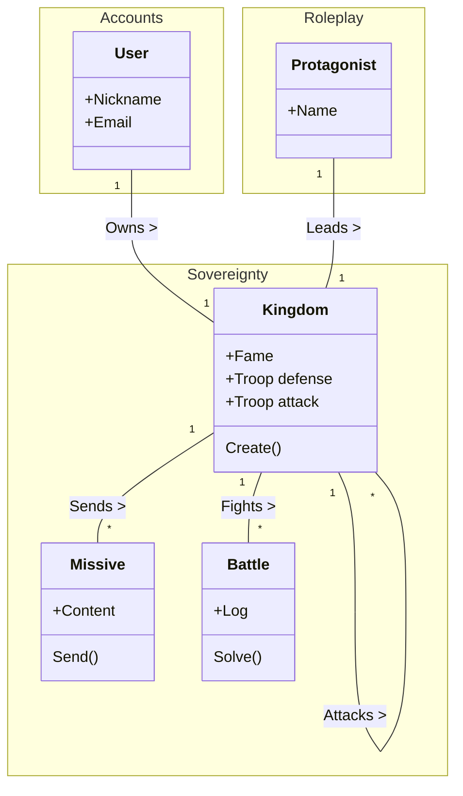

# Glossary (EN)

## Context: Sovereignty

| Term               | Business definition |
| :----------------- | :----------------   |
| **Kingdom**        | Political entity.   |
| **Fame**           | Fame mechanism.     |
| **Troop**          | Set of units.       |
| **Unit**           | Soldiers of a certain archetype |
| **Unit archetype** | Defines unit’s attributes (power, speed, kill rate, etc.) |

